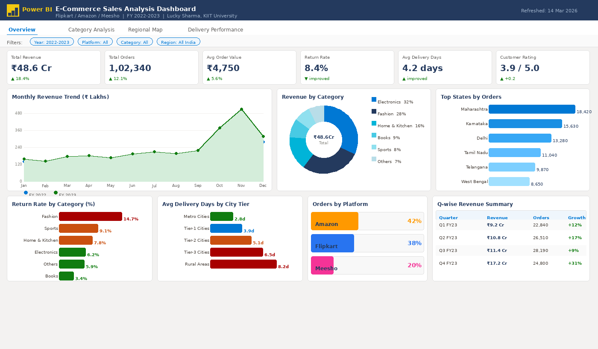
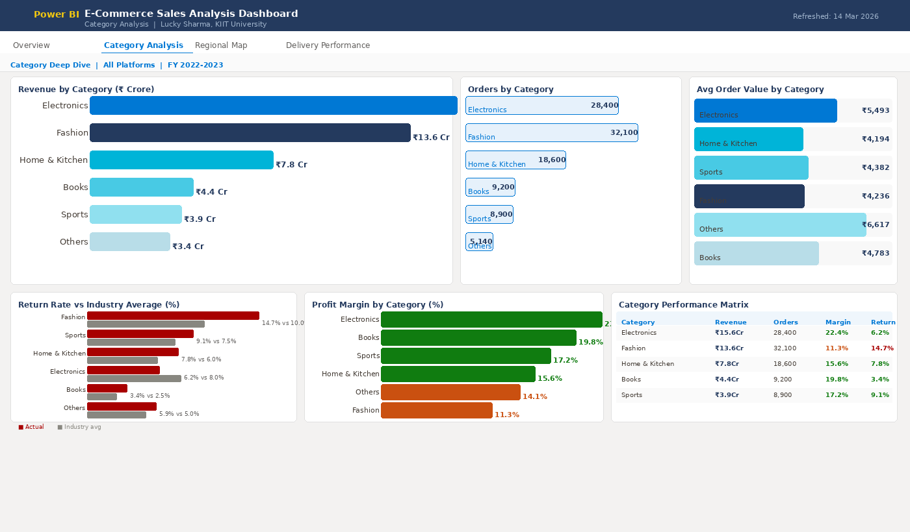
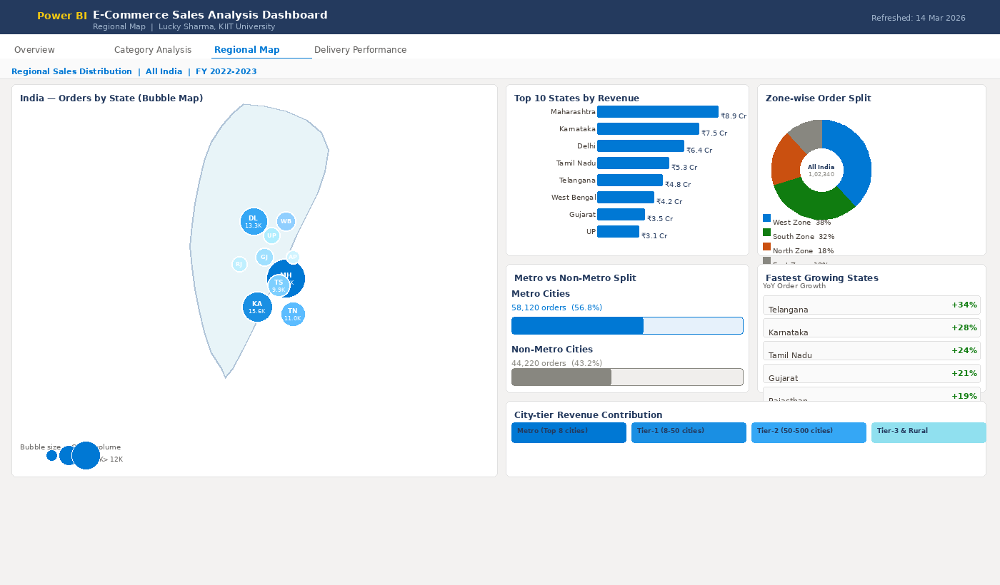
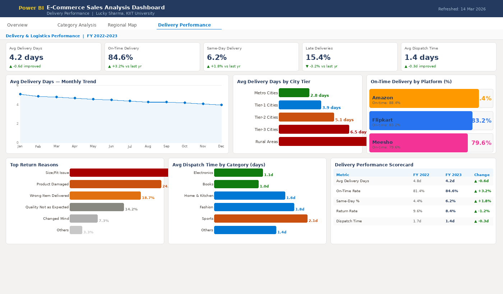
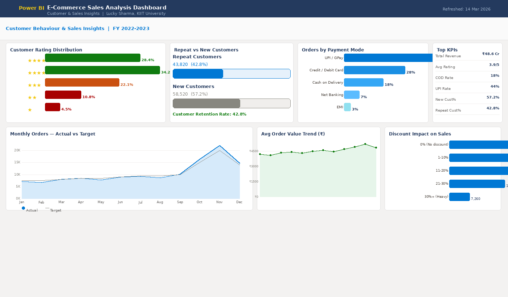

# E-Commerce Sales Analysis using Power BI


## Project Overview

An interactive Power BI dashboard built to analyse e-commerce sales data from platforms like **Flipkart**, **Amazon**, and **Meesho**. The dashboard consolidates over 1,00,000+ order records and provides actionable business insights through 5 interactive report pages.

---

## Dashboard Screenshots

### Page 1 — Overview


### Page 2 — Category Analysis


### Page 3 — Regional Map


### Page 4 — Delivery Performance


### Page 5 — Customer & Sales Insights


---

## Key Insights

| Metric | Value |
|---|---|
| Total Revenue | ₹48.6 Crore (FY 2022–23) |
| Total Orders | 1,02,340 |
| Top Category | Electronics (32% of revenue) |
| Highest Return Rate | Fashion (14.7%) |
| Avg Delivery Time | 4.2 days |
| Peak Sales Period | October–November (Diwali) — 3.2x spike |
| Top States | Maharashtra, Karnataka, Delhi (45% of orders) |
| On-Time Delivery | 84.6% |
| Customer Rating | 3.9 / 5.0 |

---

## Dashboard Pages

1. **Overview** — KPI cards, monthly revenue trend, category split, top states, platform split
2. **Category Analysis** — Revenue, orders, avg order value, profit margin, return rates per category
3. **Regional Map** — State-wise order bubble map, zone split, metro vs non-metro analysis
4. **Delivery Performance** — Delivery trends, city-tier analysis, platform on-time rates, scorecard
5. **Customer & Sales Insights** — Ratings, repeat customers, payment modes, discount impact

---

## Tech Stack

| Tool | Purpose |
|---|---|
| Power BI Desktop | Dashboard development |
| Power Query (M Language) | Data cleaning and transformation |
| DAX | KPI measures and time intelligence |
| CSV Dataset | Source data (Kaggle e-commerce dataset) |
| Star Schema | Data modelling |

---

## DAX Measures Used

```dax
-- Total Revenue
Total Revenue = SUMX(Orders, Orders[Quantity] * Orders[Unit Price])

-- Month-over-Month Growth
MoM Growth = DIVIDE([Current Month Revenue] - [Prev Month Revenue], [Prev Month Revenue])

-- Return Rate
Return Rate % = DIVIDE(COUNTROWS(FILTER(Orders, Orders[Status] = "Returned")), COUNTROWS(Orders)) * 100

-- Average Delivery Days
Avg Delivery Days = AVERAGEX(Orders, DATEDIFF(Orders[Order Date], Orders[Delivery Date], DAY))

-- On-Time Delivery Rate
On Time % = DIVIDE(COUNTROWS(FILTER(Orders, Orders[Delivery Days] <= 5)), COUNTROWS(Orders)) * 100
```

---

## Data Model

```
ORDERS (Fact Table)
    ├── Products (Dimension)
    ├── Customers (Dimension)
    ├── Calendar (Dimension)
    └── Region (Dimension)
```

---

## Project Report

📄 [View Full Project Report (PDF)](PowerBI_project_By_Lucky_Sharma.pdf)

---

## References

1. Microsoft Corporation. (2024). Power BI Documentation. [https://learn.microsoft.com/en-us/power-bi/](https://learn.microsoft.com/en-us/power-bi/)
2. Kaggle Inc. (2023). E-Commerce Sales Dataset. [https://www.kaggle.com/datasets/ecommerce-sales-data](https://www.kaggle.com/datasets/thedevastator/unlock-profits-with-e-commerce-sales-data)
3. Ferrari, A., & Russo, M. (2019). The Definitive Guide to DAX. Microsoft Press.
4. NASSCOM. (2023). Indian E-Commerce Industry Report.
5. Kimball, R., & Ross, M. (2013). The Data Warehouse Toolkit. Wiley.

---

## Internship Details

- **Program:** Microsoft Elevate — AICTE Internship (Feb 2026)
- **Topic:** E-Commerce Sales Analysis using Power BI
- **Submitted by:** Lucky Sharma
- **Institution:** KIIT University
- **GitHub:** https://github.com/luckysharma06102004-stack/ecommerce-powerbi-dashboard

---

*Built as part of the MS Elevate AICTE Internship Program, February 2026.*
